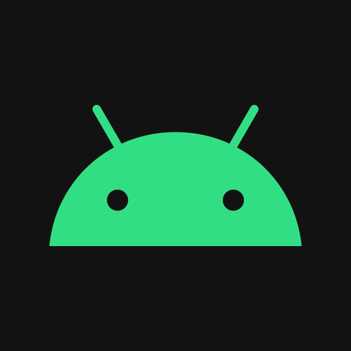

<h1 align="center">StrawKnight</h1>

<p align="center">
  
</p>

<p align="center">
  A real Android emulator on a Selkies desktop, so an app can be installed, driven and broken without an APK ever touching a phone.
</p>

<br>

## 1. What it is

A straw knight is the practice dummy: built in the shape of the real thing so somebody can strike at it without anybody getting hurt.

This container runs the **real Android emulator** - the same AVD Android Studio starts - headless on a [Selkies](https://github.com/selkies-project/selkies) desktop. The screen arrives in a browser over WebRTC, and `adb` reaches it over the network, so Android Studio deploys and debugs on it exactly like a phone on a cable.

Internal image. No Community Applications listing.

<br>

## 2. Why not Android-in-a-container

ReDroid and Waydroid run the Android userspace directly on the host kernel. They are lighter, they need no KVM, and for testing a layout they are fine.

They are the wrong tool for a **sync** app, and the reason is what they do not have: no battery, no motion sensor, no power HAL. Doze is decided by `DeviceIdleController` from exactly those signals, so in a container it never fires. WorkManager then runs more eagerly than it ever would on somebody's phone, and Android 14's limits on a `dataSync` foreground service never kick in either.

A rig that is green because it never asks the question is worse than no rig at all. A real AVD answers, and it answers on demand:

```
adb shell dumpsys deviceidle force-idle
```

<br>

## 3. Why not budtmo/docker-android

[budtmo/docker-android](https://github.com/budtmo/docker-android) does the same job and is well kept, on a monthly release cadence. Its screen is x11vnc behind noVNC: a framebuffer diff over websockets, with no hardware encoding.

Judging how an app *feels* is judging its scrolling and its transitions, which is the part noVNC smears. This image puts the emulator on the same Selkies desktop as the rest of the house, hardware-encoded on the box's own GPU.

<br>

## 4. Which Android

**14, API 34, `google_apis`, x86_64.** Both halves are a decision rather than "the newest available":

- **14** is where the six-hour daily cap on `dataSync` foreground services landed. Testing on 15 or 16 instead would test a rule the users on 14 do not have.
- **`google_apis`** carries Play services and a real DocumentsUI, which is the SAF folder picker an app asks for a folder with. An image without one cannot answer whether that flow works at all.

<br>

## 5. Running it

Needs `/dev/kvm`. On bare metal that is simply there; no nested virtualisation is involved. Without it the emulator does not start, and the container log says so in as many words rather than leaving a black rectangle.

```
docker run -d --name StrawKnight \
  --device=/dev/kvm --shm-size=2gb --cpus="4" --memory="8g" \
  -p 3001:3001 -p 5555:5555 \
  -v /path/to/config:/config \
  junkerderprovinz/strawknight:latest
```

On Unraid use [`templates/strawknight.xml`](templates/strawknight.xml), which puts it on its own IP so no port mapping is needed.

**It is deliberately not set to restart on its own.** An emulator is a virtual machine and holds its memory whether anybody is testing or not: measured idle, with no app installed, about 6 GB. Start it when it is needed and stop it after.

<br>

## 6. Using it

| | |
|---|---|
| Screen | `https://<address>:3001/` - self-signed certificate, accept it once. No login. |
| Deploy | `adb connect <address>:5555`, then Android Studio treats it as an ordinary device. |
| Force Doze | `adb -s <address>:5555 shell dumpsys deviceidle force-idle` |
| Undo it | `adb -s <address>:5555 shell dumpsys deviceidle unforce` |

The container's log ends on a banner carrying all three lines with the real address filled in.

<br>

## 7. What persists

`/config` only, and it holds the AVD itself: installed apps, granted permissions, anything a test wrote. That is not tidiness. Rebuilding the device on every start would silently reset the folder permission an app was granted through the SAF picker, which is one of the things being tested, and it would look like the app forgetting.

The device profile and the emulated RAM are therefore read on **first boot only**. Changing them later needs the AVD removed from `/config/.android/avd`.

<br>

## 8. Two things worth knowing

**The ADB port is forwarded, not bound.** The emulator's own adb daemon listens on loopback and nothing else. A forwarder inside the container hands the outside port to it. Without that, the port looks open from a development machine and the handshake never completes, which reads as a network problem and is not one.

**The emulator window is kept on screen.** Measured on the first working build, it opened at `y = -551` on a 768-pixel-tall desktop, so all but its last sixty pixels sat above the visible area - from the browser, indistinguishable from an emulator that never started. Selkies also resizes the desktop to whatever the browser window is, so a one-off placement would not hold either. A small service watches both and puts the window back whenever it has ended up outside, and leaves it alone whenever it has not.
