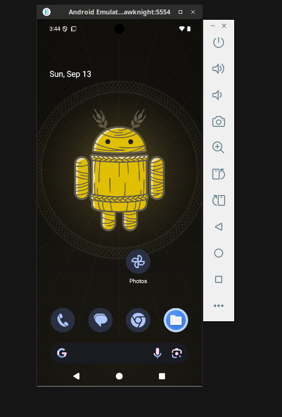
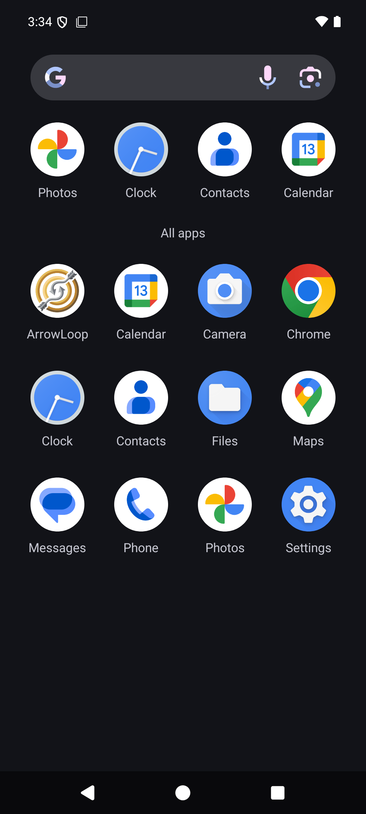
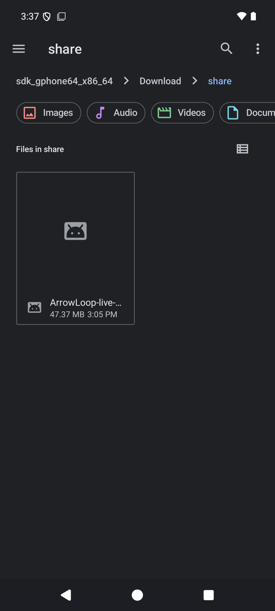
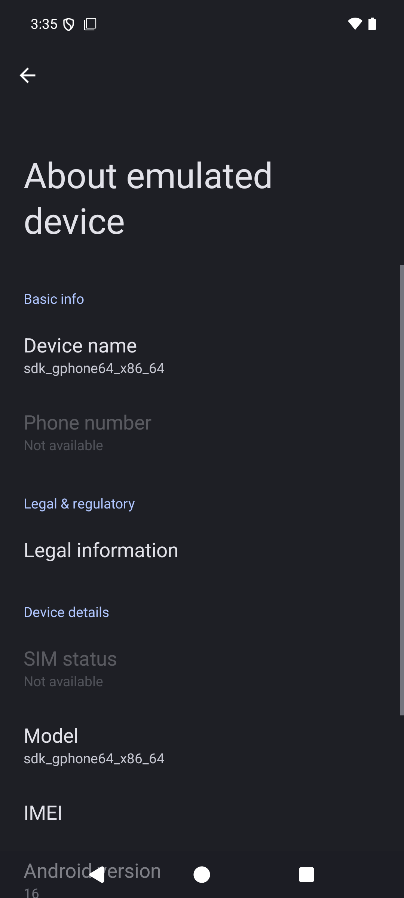

<p align="center">
  <picture>
    <source media="(prefers-color-scheme: dark)" srcset="https://raw.githubusercontent.com/junkerderprovinz/strawknight/main/.github/assets/strawknight-banner-dark.png">
    
  </picture>
</p>

<p align="center">
  <a href="https://github.com/junkerderprovinz/strawknight/actions/workflows/build.yml"></a>&nbsp;
  <a href="https://developer.android.com/about/versions/16"></a>&nbsp;
  <a href="https://github.com/selkies-project/selkies"></a>&nbsp;
  <a href="templates/strawknight.xml"></a>&nbsp;
  <a href="https://github.com/junkerderprovinz/strawknight/releases/latest"></a>&nbsp;
  <a href="LICENSE"></a>
</p>

<br>

<p align="center">
  A real Android emulator on a Selkies desktop, so an app can be installed, driven and broken without an APK ever touching a phone.
</p>

<br>

<p align="center">
  <a href="https://github.com/junkerderprovinz/strawknight/releases/latest/download/docker-compose.yml"></a>
  &nbsp;
  <a href="https://github.com/junkerderprovinz/strawknight/archive/refs/heads/main.zip"></a>
  <br>
  <sub>Both download on click &middot; the image itself: <code>docker pull ghcr.io/junkerderprovinz/strawknight:latest</code> &middot; on Unraid, use the template.</sub>
</p>

<p align="center">
One knight's job: I build it, keep it running, work through the issues and add what people ask for, until nothing is missing. No accounts, no telemetry, no ads. No trial, no tier, no asterisk. Nothing readable ever leaves your own walls.
</p>

<p align="center">
If it has earned a place on your computer or server, a donation covers what it costs: the domain, the server, and the evenings that go into it. It also makes this knight's heart beat a little faster. Three ways below, whichever suits you.
</p>

<br>

<p align="center">
  <a href="https://buymeacoffee.com/junkerderprovinz"></a>
  &nbsp;
  <a href="https://paypal.me/hallelujadesign"></a>
  &nbsp;
  <a href="https://junkerderprovinz.github.io/junkerderprovinz/"></a>
</p>

<br>

## Table of Contents

1. [What it is](#1-what-it-is)
2. [Screenshots](#2-screenshots)
3. [Why not Android-in-a-container](#3-why-not-android-in-a-container)
4. [Why not budtmo/docker-android](#4-why-not-budtmodocker-android)
5. [Which Android](#5-which-android)
6. [Running it](#6-running-it)
7. [Using it](#7-using-it)
8. [What persists](#8-what-persists)
9. [Two things worth knowing](#9-two-things-worth-knowing)
10. [Support this project](#10-support-this-project)

<br>

## 1. What it is

A straw knight is the practice dummy: built in the shape of the real thing so somebody can strike at it without anybody getting hurt.

This container runs the **real Android emulator** - the same AVD Android Studio starts - headless on a [Selkies](https://github.com/selkies-project/selkies) desktop. The screen arrives in a browser over WebRTC, and `adb` reaches it over the network, so Android Studio deploys and debugs on it exactly like a phone on a cable.

<br>

## 2. Screenshots

<p align="center">
  
  <br><em>Android 16 on the Selkies desktop, in a browser. The strip on the right is the emulator's own toolbar, not part of the phone.</em>
</p>

<br>

<p align="center">
  
  &nbsp;
  
  &nbsp;
  
  <br><em>The app drawer, with an APK installed over adb. Anything dropped into <code>/share</code> turns up under <code>Download/share</code>, so a build can be installed by tapping it. And the device says what it is: Android 16, API 36.</em>
</p>

<br>

## 3. Why not Android-in-a-container

ReDroid and Waydroid run the Android userspace directly on the host kernel. They are lighter, they need no KVM, and for testing a layout they are fine.

They are the wrong tool for a **sync** app, and the reason is what they do not have: no battery, no motion sensor, no power HAL. Doze is decided by `DeviceIdleController` from exactly those signals, so in a container it never fires. WorkManager then runs more eagerly than it ever would on somebody's phone, and Android 14's limits on a `dataSync` foreground service never kick in either.

A rig that is green because it never asks the question is worse than no rig at all. A real AVD answers, and it answers on demand:

```
adb shell dumpsys deviceidle force-idle
```

<br>

## 4. Why not budtmo/docker-android

[budtmo/docker-android](https://github.com/budtmo/docker-android) does the same job and is well kept, on a monthly release cadence. Its screen is x11vnc behind noVNC: a framebuffer diff over websockets, with no hardware encoding.

Judging how an app *feels* is judging its scrolling and its transitions, which is the part noVNC smears. This image puts the emulator on the same Selkies desktop as the rest of the house, hardware-encoded on the box's own GPU.

<br>

## 5. Which Android

**16, API 36, `google_apis`, x86_64**, and the level is the newest on purpose.

This started at 14, reasoning that Android 14 is where the six-hour daily cap on `dataSync` foreground services landed. That was too cautious: 15 keeps the cap and adds a timeout on top, 16 keeps both, so the newest level is the **strictest** rather than a different one - and the Play Store wants a recent target level for a new submission anyway. Pinning to 14 would have been testing a rule more lenient than the one the app ships under.

`google_apis` rather than plain AOSP, because it carries Play services and a real DocumentsUI, which is the SAF folder picker an app asks for a folder with. An image without one cannot answer whether that flow works at all.

Only one level is installed, and that has a consequence: an AVD in the persistent volume names its system image by path, so raising `ANDROID_API` leaves the existing device pointing at an image the container no longer has. The boot script notices, moves the stale device aside as `<name>.avd.old-<stamp>`, says in the log that everything installed on it is gone with it, and builds a fresh one.

<br>

## 6. Running it

Needs `/dev/kvm`. On bare metal that is simply there; no nested virtualisation is involved. Without it the emulator does not start, and the container log says so in as many words rather than leaving a black rectangle.

```
docker run -d --name StrawKnight \
  --device=/dev/kvm --shm-size=2gb --cpus="4" --memory="8g" \
  -e PUID=99 -e PGID=100 \
  -p 3001:3001 -p 5555:5555 \
  -v /path/to/config:/config \
  ghcr.io/junkerderprovinz/strawknight:latest
```

`PUID` and `PGID` decide who owns `/config`, and they should be the user that owns the directory on the host. The defaults above are Unraid's `nobody:users`; on a plain Linux box `$(id -u):$(id -g)` is usually what you want.

On Unraid use [`templates/strawknight.xml`](templates/strawknight.xml), which puts it on its own IP so no port mapping is needed.

**It is deliberately not set to restart on its own.** An emulator is a virtual machine and holds its memory whether anybody is testing or not: measured idle, with no app installed, about 6 GB. Start it when it is needed and stop it after.

<br>

## 7. Using it

| | |
|---|---|
| Screen | `https://<address>:3001/` - self-signed certificate, accept it once. No login. |
| Deploy | `adb connect <address>:5555`, then Android Studio treats it as an ordinary device. |
| Force Doze | `adb -s <address>:5555 shell dumpsys deviceidle force-idle` |
| Undo it | `adb -s <address>:5555 shell dumpsys deviceidle unforce` |

The container's log ends on a banner carrying all three lines with the real address filled in.

### From the container's own terminal

Mount a share read-only at `/share` and an APK dropped into it from anywhere on the network can be installed without leaving the browser. `sk` is the helper:

```
sk list                    the APKs on the share, newest first
sk install <name>.apk      install one, keeping the earlier build's data
sk push <file|dir>         copy test files into the device's Downloads
sk doze on | off           force deep idle, or release it
sk shell [...]             a shell on the device
```

A bare name is taken relative to the share, so `sk install arrowloop.apk` finds `/share/arrowloop.apk`.

The share is mounted **read-only** on purpose: this rig runs unfinished code, and unfinished code has no business writing to a share full of everything else. `sk push` copies INTO the device instead, and tells the media scanner about it - without that the file is on the disk and absent from every chooser, which looks exactly like the push having silently failed.

`sk doze on` unplugs the battery before forcing idle, which is not optional: a device that believes it is charging refuses to go idle, and the force then reports success while nothing happens.

### The share, on the phone itself

Everything in `/share` also appears **on the device**, under `Download/share`, where the stock Files app and the SAF picker both find it. So an APK dropped into the share from any machine on the network can be installed by tapping it on the phone, without touching a terminal at all.

**Mirrored rather than mounted**, and that is the only thing available rather than a shortcut. The emulated phone is a virtual machine with its own kernel and its own disk image: a directory on the host is not reachable from inside it by any mount. The emulator has no shared-folder feature, Android's own Files app speaks no SMB, and an SD card image would be a snapshot rather than a live folder. What does cross the boundary is `adb`, so `svc-share-mirror` copies - one direction only, host to phone, matching the share's own read-only mount.

It compares timestamps and sizes and sends only what differs, so the steady state costs one comparison every thirty seconds and no traffic. `SHARE_MIRROR_SECONDS` changes the interval.

There is a **cap**, and on Unraid it matters: the share this is usually pointed at is the download folder, a place whose whole job is to grow. Above `SHARE_MIRROR_MAX_MB` (2048 by default) the mirror stops and says so in the log rather than filling the emulator's disk - which would otherwise surface much later as an app that will not install, for reasons that have nothing to do with the app. Refused rather than truncated: a mirror that quietly copies *some* of a folder is worse than one that says it stopped, because the missing file is the one somebody is looking for. `sk install` still works either way.

<br>

## 8. What persists

`/config` only, and it holds the AVD itself: installed apps, granted permissions, anything a test wrote. That is not tidiness. Rebuilding the device on every start would silently reset the folder permission an app was granted through the SAF picker, which is one of the things being tested, and it would look like the app forgetting.

The device profile and the emulated RAM are therefore read on **first boot only**. Changing them later needs the AVD removed from `/config/.android/avd`.

The wallpaper and the monochrome icons are set the same way, once, on the first boot of a new AVD. A marker in `/config` stops them from being written again, so a wallpaper you pick yourself afterwards is yours and stays.

<br>

## 9. Two things worth knowing

**The ADB port is forwarded, not bound.** The emulator's own adb daemon listens on loopback and nothing else. A forwarder inside the container hands the outside port to it. Without that, the port looks open from a development machine and the handshake never completes, which reads as a network problem and is not one.

**The emulator window is kept on screen.** Measured on the first working build, it opened at `y = -551` on a 768-pixel-tall desktop, so all but its last sixty pixels sat above the visible area - from the browser, indistinguishable from an emulator that never started. Selkies also resizes the desktop to whatever the browser window is, so a one-off placement would not hold either. A small service watches both and puts the window back whenever it has ended up outside, and leaves it alone whenever it has not.

<br>

## 10. Support this project

Problems, wishes or suggestions? You're welcome to [open an issue](https://github.com/junkerderprovinz/strawknight/issues).

One knight's job: I build it, keep it running, work through the issues and add what people ask for, until nothing is missing. No accounts, no telemetry, no ads. No trial, no tier, no asterisk. Nothing readable ever leaves your own walls.

If it has earned a place on your computer or server, a donation covers what it costs: the domain, the server, and the evenings that go into it. It also makes this knight's heart beat a little faster. Three ways below, whichever suits you.

<p align="center">
  <a href="https://buymeacoffee.com/junkerderprovinz"></a>
  &nbsp;
  <a href="https://paypal.me/hallelujadesign"></a>
  &nbsp;
  <a href="https://junkerderprovinz.github.io/junkerderprovinz/"></a>
</p>
