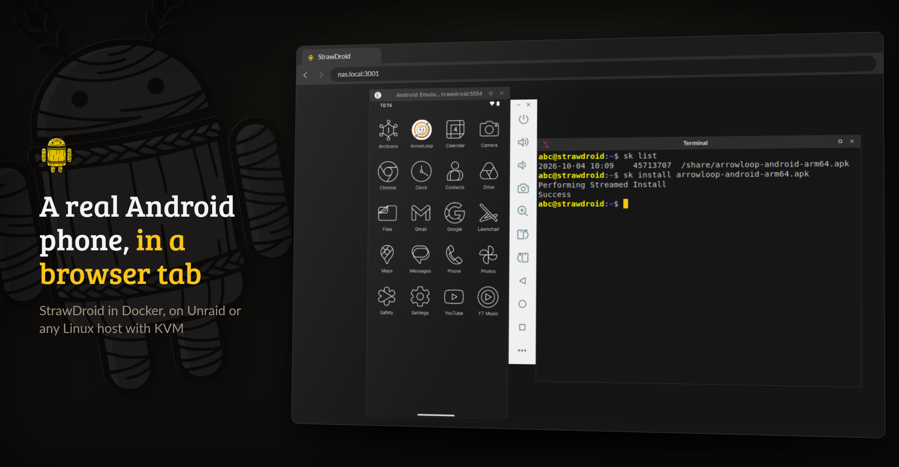
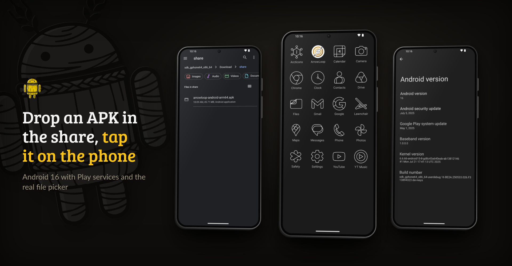

<p align="center">
  <picture>
    <source media="(prefers-color-scheme: dark)" srcset="https://raw.githubusercontent.com/junkerderprovinz/strawdroid/main/.github/assets/strawdroid-banner-dark.png">
    
  </picture>
</p>

<p align="center">
  <a href="https://github.com/junkerderprovinz/strawdroid/actions/workflows/build.yml"></a>&nbsp;
  <a href="https://developer.android.com/about/versions/16"></a>&nbsp;
  <a href="https://github.com/selkies-project/selkies"></a>&nbsp;
  <a href="templates/strawdroid.xml"></a>&nbsp;
  <a href="https://github.com/junkerderprovinz/strawdroid/releases/latest"></a>&nbsp;
  <a href="LICENSE"></a>
</p>

<br>

<p align="center">
  A real Android emulator on a Selkies desktop, so an app can be installed, driven and broken without an APK ever touching a phone.
</p>

<br>

<!-- download-buttons: written by scripts/gen_download_buttons.py -->
<p align="center">
  <a href="https://ca.unraid.net/apps/strawdroid-023jr4h1s1s5il"></a>
  &nbsp;
  <a href="https://github.com/junkerderprovinz/strawdroid/releases/latest/download/docker-compose.yml"></a>
  &nbsp;
  <a href="https://github.com/junkerderprovinz/strawdroid/archive/refs/heads/main.zip"></a>
</p>
<br>
<p align="center">
  <a href="https://github.com/junkerderprovinz/strawdroid/releases/latest/download/start-windows.ps1"></a>
  &nbsp;
  <a href="https://github.com/junkerderprovinz/strawdroid/releases/latest/download/start-linux.sh"></a>
  <br><sub>Always downloads the latest build</sub>
</p>
<!-- /download-buttons -->

<br>

<p align="center">
A one-knight job: I build it, keep it running, work through the issues and add what people ask for, until nothing is missing. It is free, with no accounts, no telemetry, no ads and no paid tier. No asterisk anywhere. Nothing readable ever leaves your own walls. Forged on evenings and weekends, with heart and stubbornness.
</p>

<p align="center">
If it has earned a place on your server or computer, toss a coin to your knight: it helps cover the costs and keeps the project alive. It also makes this knight's heart beat a little faster. Three ways below, whichever suits you.
</p>

<br>

<!-- give-buttons: written by scripts/gen_download_buttons.py -->
<p align="center">
  <a href="https://buymeacoffee.com/junkerderprovinz"></a>
  &nbsp;
  <a href="https://www.paypal.com/donate/?hosted_button_id=76FVV52TKXTUS"></a>
  &nbsp;
  <a href="https://junkerderprovinz.github.io/junkerderprovinz/"></a>
</p>
<!-- /give-buttons -->

<br>

## Table of Contents

1. [What it looks like](#1-what-it-looks-like)
2. [What it does](#2-what-it-does)
3. [Getting started](#3-getting-started)
4. [How AI is used here](#4-how-ai-is-used-here)
5. [Support this project](#5-support-this-project)

<br>

## 1. What it looks like

<p align="center">
  
  <br><em>Android 16 on the Selkies desktop, in a browser. The strip beside the phone is the emulator's own toolbar, and the terminal is one right-click away.</em>
</p>

<br>

<p align="center">
  
  <br><em>Anything dropped into <code>/share</code> turns up under <code>Download/share</code>, so a build can be installed by tapping it. The app drawer shows it installed, and the device says what it is: Android 16.</em>
</p>

<br>

## 2. What it does

A straw droid is a practice dummy shaped like an Android phone: built like the real thing so somebody can strike at it without anybody getting hurt.

- **The real emulator.** It runs the same AVD Android Studio starts, headless on a [Selkies](https://github.com/selkies-project/selkies) desktop. It has a battery, a motion sensor and a power HAL, so Doze and Android's limits on background work behave as they do on a phone. Android in a container such as ReDroid or Waydroid has none of these, and there Doze never fires.
- **The screen in a browser.** The desktop arrives over WebRTC, encoded on the box's own GPU, so scrolling and transitions look the way they will on a phone.
- **Deploys like a phone on a cable.** `adb` reaches the device over the network, and Android Studio installs and debugs on it as on any other device.
- **Android 16, API 36, `google_apis`, x86_64.** The newest level is also the strictest about background work. The image carries Play services and the real DocumentsUI, the folder picker an app asks for a folder with.
- **APKs from a share.** A folder mounted at `/share` shows up on the device under `Download/share`, and the `sk` helper in the container's terminal installs from it.
- **A device that stays.** `/config` holds the AVD with its apps, permissions and test data. On first boot it gets a wallpaper, dark mode, an empty home screen, the [Lawnchair](https://github.com/LawnchairLauncher/lawnchair) launcher (Apache-2.0) and the [Arcticons](https://github.com/Donnnno/Arcticons) line icons by Donnnno (GPL-3.0). Whatever you change afterwards stays as you set it.

<br>

## 3. Getting started

StrawDroid needs `/dev/kvm`. On bare metal it is simply there. Without it the emulator does not start, and the container log says so.

```
docker run -d --name StrawDroid \
  --device=/dev/kvm --shm-size=2gb --cpus="4" --memory="8g" \
  -e PUID=99 -e PGID=100 \
  -p 3001:3001 -p 5555:5555 \
  -v /path/to/config:/config \
  ghcr.io/junkerderprovinz/strawdroid:latest
```

`PUID` and `PGID` should be the user that owns `/path/to/config` on the host. The values above are Unraid's `nobody:users`; on a plain Linux box `$(id -u)` and `$(id -g)` are usually right. On Unraid use [`templates/strawdroid.xml`](templates/strawdroid.xml), which puts the container on its own IP so no port mapping is needed.

The container does not restart on its own. An emulator is a virtual machine and holds about 6 GB of memory even when idle, so start it when you need it and stop it after.

**On Windows and on a desktop Linux,** the two start scripts at the top check KVM and start the container. Docker is required either way. On Windows the script also switches on nested virtualisation for WSL2 and loads KVM there, on every run, because Docker Desktop rebuilds its WSL machine whenever it restarts. Right-click [`start-windows.ps1`](scripts/start-windows.ps1) and choose *Run with PowerShell*; if the execution policy stops it, `powershell -ExecutionPolicy Bypass -File start-windows.ps1` runs it once. On Linux, `chmod +x start-linux.sh && ./start-linux.sh`. Both are plain text, so read them before you run them.

Once it runs:

| | |
|---|---|
| Screen | `https://<address>:3001/`, with a self-signed certificate to accept once. No login. |
| Deploy | `adb connect <address>:5555`, then Android Studio treats it as an ordinary device. |
| Force Doze | `adb -s <address>:5555 shell dumpsys deviceidle force-idle` |
| Undo it | `adb -s <address>:5555 shell dumpsys deviceidle unforce` |

The container log ends on a banner with these lines and the real address filled in.

Mount a folder read-only at `/share` to install builds from it. On the device it is copied to `Download/share` every 30 seconds (`SHARE_MIRROR_SECONDS`), up to 2048 MB (`SHARE_MIRROR_MAX_MB`). In the container's terminal, `sk` does the rest:

```
sk list                    the APKs on the share, newest first
sk install <name>.apk      install one, keeping the earlier build's data
sk push <file|dir>         copy test files into the device's Downloads
sk doze on | off           force deep idle, or release it
sk shell [...]             a shell on the device
```

The device profile and the emulated RAM are read on the first boot only. To change them later, remove the AVD from `/config/.android/avd`.

<br>

## 4. How AI is used here

One knight builds this, and AI is one of the tools I work with, the same way I work with an editor or a compiler. It helps me write code and documentation and it checks my work, and that saves me a good many evenings. It does not make the decisions, though. I read and understand everything before it ships, and if something here breaks, that is on me and not on the tool.

You do not have to take my word for it. The code is open and every release note is written by hand. The issue tracker shows how problems actually get handled, including the ones I got wrong the first time. If you find something that is not right, open an issue and I will look at it.

<br>

## 5. Support this project

Problems, wishes or suggestions? You're welcome to [open an issue](https://github.com/junkerderprovinz/strawdroid/issues).

A one-knight job: I build it, keep it running, work through the issues and add what people ask for, until nothing is missing. It is free, with no accounts, no telemetry, no ads and no paid tier. No asterisk anywhere. Nothing readable ever leaves your own walls. Forged on evenings and weekends, with heart and stubbornness.

If it has earned a place on your server or computer, toss a coin to your knight: it helps cover the costs and keeps the project alive. It also makes this knight's heart beat a little faster. Three ways below, whichever suits you.

<!-- give-buttons: written by scripts/gen_download_buttons.py -->
<p align="center">
  <a href="https://buymeacoffee.com/junkerderprovinz"></a>
  &nbsp;
  <a href="https://www.paypal.com/donate/?hosted_button_id=76FVV52TKXTUS"></a>
  &nbsp;
  <a href="https://junkerderprovinz.github.io/junkerderprovinz/"></a>
</p>
<!-- /give-buttons -->
